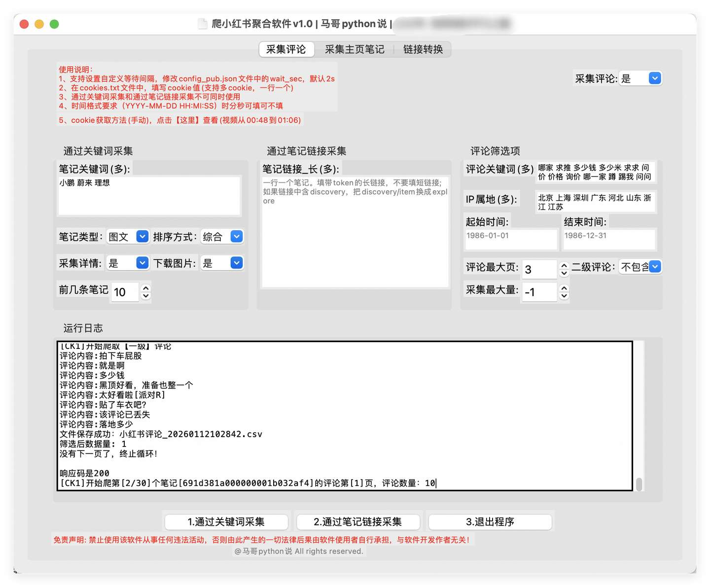
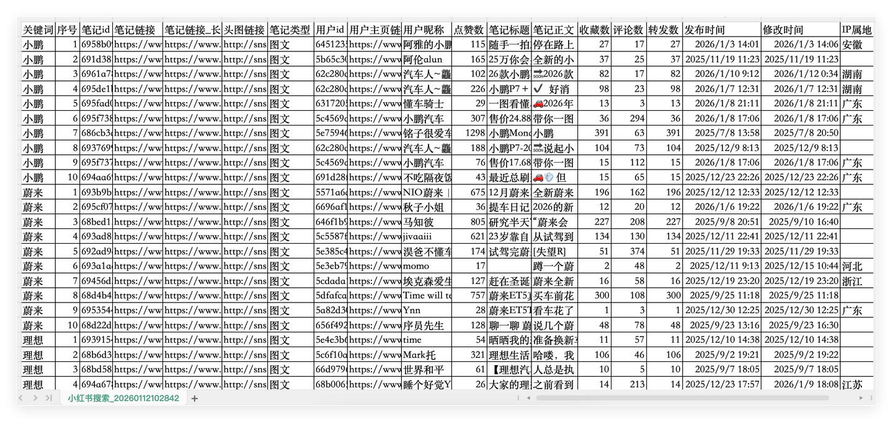
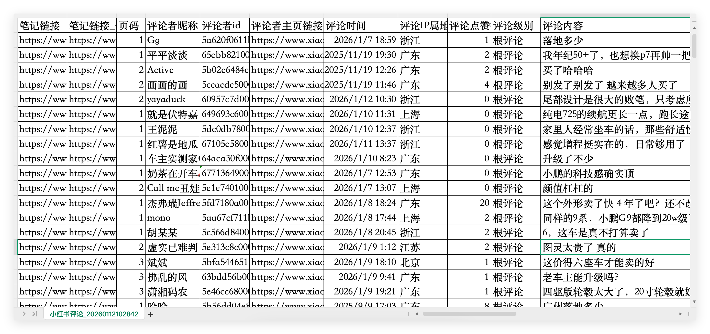
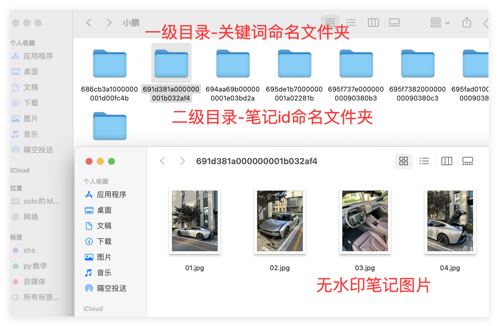
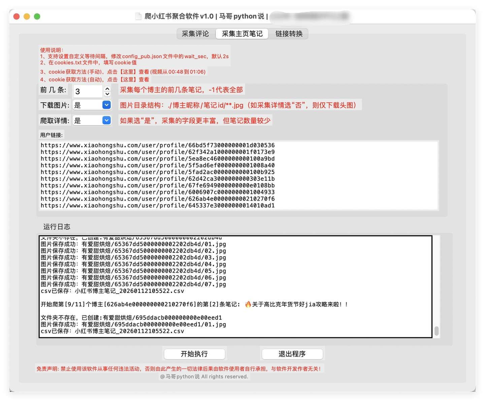
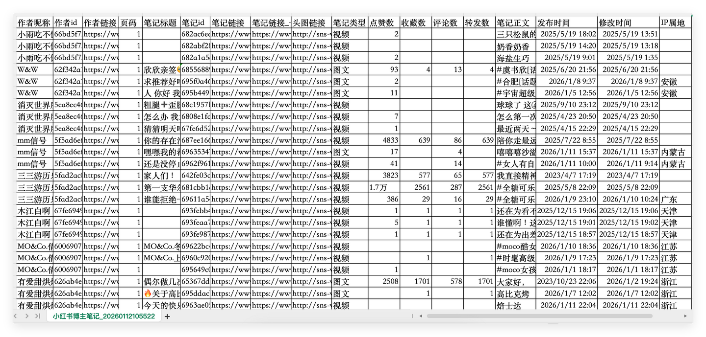
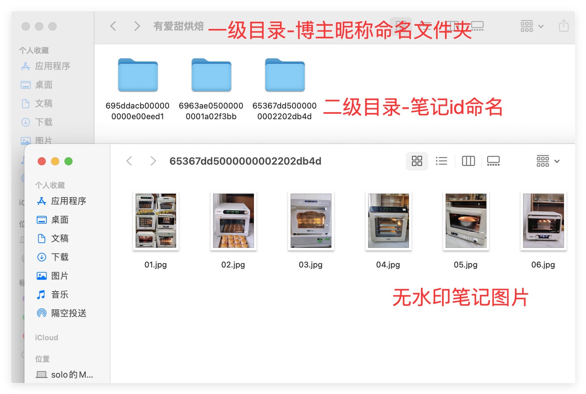
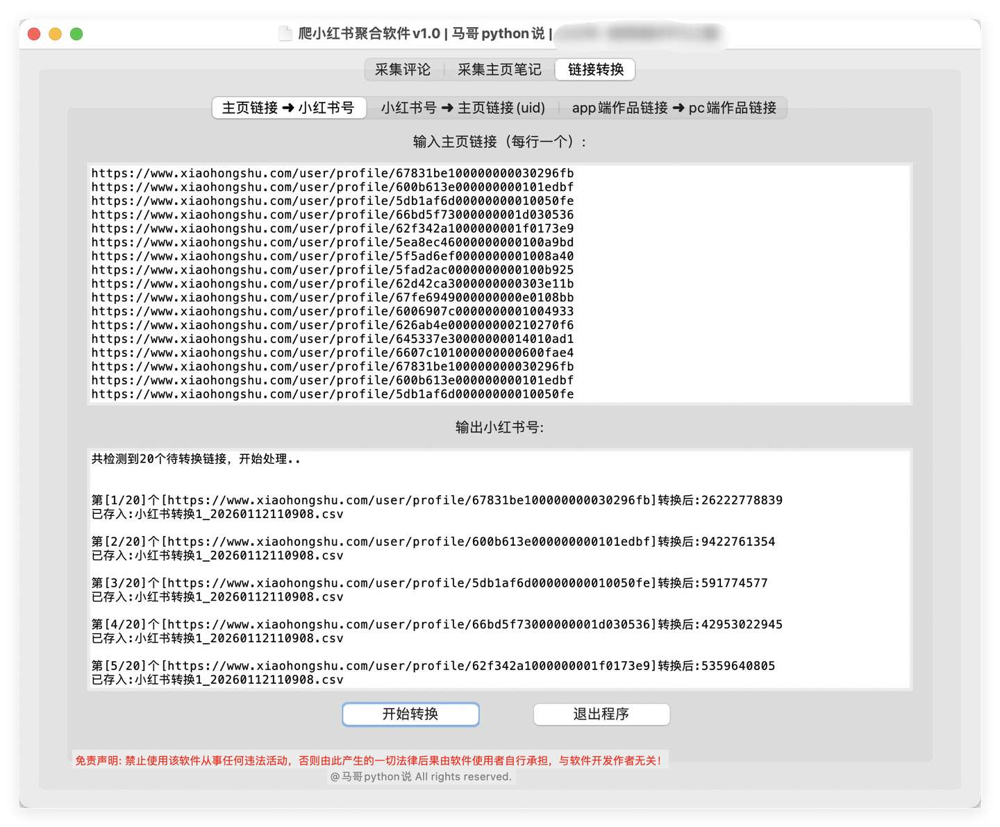
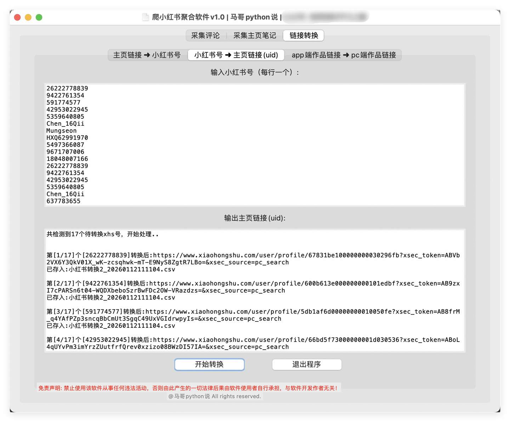
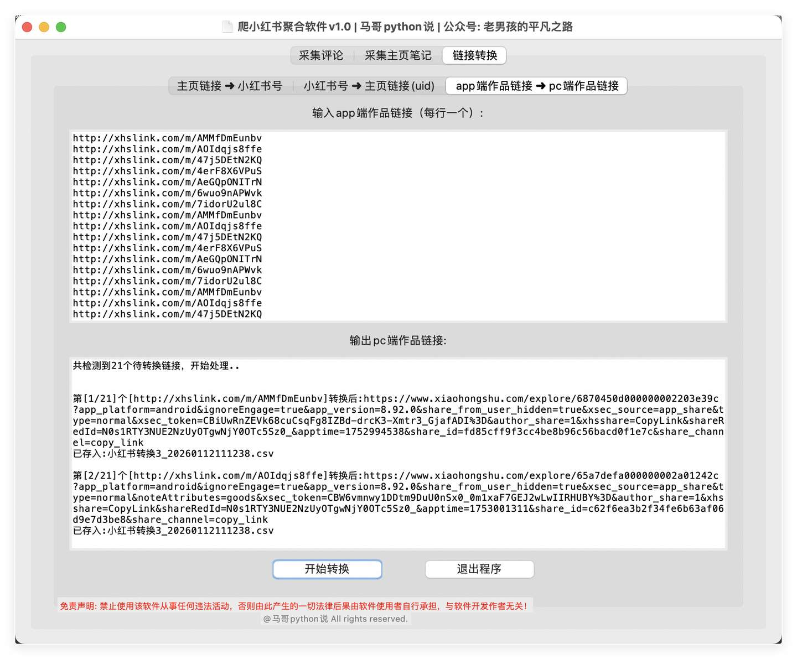

# xhs_one_spider

   

  <a href="README.md">简体中文 README</a> | <a href="README.en.md">English README</a>

> 🔥 小红书数据采集工具 / Xiaohongshu crawler GUI，支持小红书笔记采集、评论采集、博主主页采集、图片下载、CSV 导出和链接转换。
>
> 💡 支持 Windows/macOS，无需配置 Python 环境；仓库用于软件介绍、版本发布、使用说明和问题反馈，完整源码暂不公开。
>
> [⬇️下载最新版](https://github.com/mashukui/xhs_one_spider/releases/) | [🎬使用演示](https://www.bilibili.com/video/BV1Z6rHBfExT/) | [🏠产品主页](https://mashukui.github.io/xhs_one_spider/) | [💳开通使用](https://mgnb.pro/product/xhs)

## 👋 软件简介

`xhs_one_spider` 是一款面向小红书数据采集场景的桌面GUI工具，整合了搜索笔记采集、评论采集、博主笔记采集、链接转换等常用能力。用户无需配置python环境，下载客户端后登录即可使用。

它适合以下场景：

| 场景 | 说明 |
| --- | --- |
| ✅ 获客截流 | 从行业、品牌、竞品相关笔记评论区采集潜在用户线索 |
| ✅ 种草分析 | 采集关键词相关笔记、评论和互动数据，分析用户关注点 |
| ✅ 内容创作 | 分析优质博主笔记结构、选题方向和互动表现 |
| ✅ 小红书运营 | 进行主页链接、小红书号、uid、笔记链接等格式转换 |

## ⚙️ 功能概览

| 功能 | 说明 | 输出 |
| --- | --- | --- |
| ✅ 搜索笔记采集 | 按关键词搜索小红书笔记，采集笔记基础数据 | CSV文件、图片文件 |
| ✅ 评论采集 | 根据搜索结果或指定笔记链接采集评论 | CSV文件 |
| ✅ 博主笔记采集 | 根据博主主页链接采集主页笔记列表 | CSV文件、图片文件 |
| ✅ 链接与uid转换 | 支持主页链接、小红书号、uid、笔记链接之间的转换 | CSV文件 |
| ✅ 图片、视频下载 | 支持高清无水印的笔记图片、视频下载 | 图片、视频 |
| ✅ 运行日志 | 自动记录运行过程，便于排查问题 | logs日志 |

## 🚀 快速开始

1. 打开 [Releases](https://github.com/mashukui/xhs_one_spider/releases/) 下载最新版软件。
2. 解压后运行对应系统的客户端。
3. 使用软件内置的「cookie小工具」完成cookie配置。
4. 登录软件账号（还没账号？[日卡19元起，支付秒开通](#-价格说明)）。
5. 选择采集模块，填写关键词、笔记链接或博主主页链接。
6. 点击「开始执行」，等待采集完成。
7. 在软件所在目录查看CSV、图片文件和日志文件。

## 💻 支持系统

| 系统 | 支持情况 |
| --- | --- |
| Windows | 支持，下载 Windows 客户端即可运行 |
| macOS | 支持，下载 macOS 客户端即可运行 |

## 🖼️ 功能展示

### 搜索笔记与评论采集

采集评论界面：

搜索笔记结果：

评论采集结果：

自动下载的搜索笔记图片：

### 博主笔记采集

博主笔记采集界面：

博主笔记结果：

自动下载的博主笔记图片：

### 链接与 uid 转换

主页链接转小红书号：

小红书号转主页链接：

app端笔记链接转pc端笔记链接：

## 📊 输出字段

软件会根据不同采集模块生成对应的CSV文件。字段较多，下面先按数据类型展示主要字段范围；需要完整字段时，可展开查看。

### 搜索笔记数据

- 采集信息：关键词、序号
- 笔记信息：笔记id、笔记链接、笔记长链接、头图链接、笔记类型、笔记标题、笔记正文
- 作者信息：用户id、用户主页链接、用户昵称
- 互动数据：点赞数、收藏数、评论数、转发数
- 时间与属地：发布时间、修改时间、IP属地

查看搜索笔记完整字段

关键词、序号、笔记id、笔记链接、笔记链接_长、头图链接、笔记类型、用户id、用户主页链接、用户昵称、点赞数、笔记标题、笔记正文、收藏数、评论数、转发数、发布时间、修改时间、IP属地

### 评论数据

- 采集信息：笔记链接、笔记长链接、页码
- 评论者信息：评论者昵称、评论者 id、评论者主页链接
- 评论信息：评论时间、评论IP属地、评论点赞数、评论级别、评论内容

查看评论完整字段

笔记链接、笔记链接_长、页码、评论者昵称、评论者id、评论者主页链接、评论时间、评论IP属地、评论点赞数、评论级别、评论内容

### 博主笔记数据

- 采集信息：页码
- 作者信息：作者昵称、作者id、作者主页链接
- 笔记信息：笔记标题、笔记id、笔记链接、笔记长链接、头图链接、笔记类型、笔记正文
- 互动数据：点赞数、收藏数、评论数、转发数
- 时间与属地：发布时间、修改时间、IP属地

查看博主笔记完整字段

作者昵称、作者id、作者链接、页码、笔记标题、笔记id、笔记链接、笔记链接_长、头图链接、笔记类型、点赞数、收藏数、评论数、转发数、笔记正文、发布时间、修改时间、IP属地

## 🛠️ 技术说明

软件采用 Python 开发，核心模块包括：

| 模块 | 用途 |
| --- | --- |
| tkinter | GUI软件界面 |
| requests | 接口请求 |
| json | 响应数据解析 |
| pandas | CSV数据保存 |
| logging | 运行日志记录 |

软件通过接口协议采集数据，不依赖模拟浏览器等RPA操作。采集过程中默认按页保存结果，每页请求间隔约 1-2 秒，便于控制采集节奏并降低异常中断造成的数据损失。

## 💰 价格说明

| 类型 | 使用期限 | 价格 | 适用场景 |
| --- | --- | --- | --- |
| 日卡 | 1 天 | 19 元 | 临时试用、小批量任务 |
| 月卡 | 1 个月 | 149 元 | 短期采集需求 |
| 季卡 | 3 个月 | 349 元 | 中期采集需求 |
| 年卡 | 1 年 | 799 元 | 长期稳定使用 |

开通入口：[https://mgnb.pro/product/xhs](https://mgnb.pro/product/xhs)

## 🔐 授权规则

- 软件采用账号密码登录（购买后获得手机号和密码），一机一码，一个账号仅支持一台电脑使用。
- 一台电脑仅允许运行一个软件实例，不支持多开。
- 软件由作者长期维护，后续版本通过 [GitHub Releases](https://github.com/mashukui/xhs_one_spider/releases/) 发布。

## 🕒 更新日志

| 版本 | 发布日期 | 更新内容 |
|---|---|---|
| v1.5 | 2026-07-22 | 新增无水印视频下载（搜索/笔记链接/博主主页三种场景）；链接转换新增字段 |
| v1.4 | 2026-06-13 | 适配最新接口协议；新增 cookie 轮换，采集更持久；修复小红书号转 uid 卡顿 |
| v1.3 | 2026-03-24 | 新增用户注册入口 |

> 完整更新历史见 [Releases](https://github.com/mashukui/xhs_one_spider/releases)

## ❓ 常见问题

### 换电脑或重装系统后还能用吗？

可以。授权采用一机一码，一个账号绑定一台电脑；如需更换设备，请联系[公众号「老男孩的平凡之路」](https://github.com/mashukui/mashukui/blob/main/wechat2.png)后台申请解绑，处理后即可在新电脑登录使用。

### 软件更新需要重新购买吗？

不需要。授权有效期内，后续版本均通过 [GitHub Releases](https://github.com/mashukui/xhs_one_spider/releases) 免费更新，下载最新版覆盖安装即可。

### 是否需要安装Python？

不需要。软件已打包为桌面客户端，下载对应系统版本后即可运行。

### cookie是做什么用的？

cookie用于让软件以当前账号状态访问平台数据。请使用自己的账号cookie，并妥善保管相关文件。

### 采集中断后数据会丢失吗？

软件按页保存CSV，不是等全部采集结束后才保存。即使中途中断，已完成页的数据通常仍会保留在结果文件中。

### 结果文件保存在哪里？

默认保存在软件所在文件夹。CSV、图片文件和日志文件会根据功能模块分别生成。

### 支持采集多少数据？

实际可采集数量会受到关键词、账号状态、平台接口返回、网络环境和采集频率等因素影响。建议合理设置采集范围和请求间隔。

### 软件报错怎么办？

请优先查看 `logs` 目录下的日志文件，并在反馈时提供以下信息：

- 软件版本
- 操作系统
- 使用的功能模块
- 输入的关键词、博主主页链接或笔记链接
- 报错截图
- 对应时间段的日志内容

## ⚠️ 合规声明

本软件仅供合法合规的数据分析、学习研究和自有业务场景使用。使用者应自行遵守目标平台服务协议、隐私政策以及所在地法律法规。

请勿将本软件用于以下用途：

- 高频、恶意或破坏性请求
- 未经授权采集、传播或售卖个人敏感信息
- 侵犯平台、作者或用户合法权益的行为
- 违反法律法规或平台规则的其他行为

因使用者不当使用造成的风险和责任，由使用者自行承担。

## 📦 获取软件

- GitHub Releases：[https://github.com/mashukui/xhs_one_spider/releases/](https://github.com/mashukui/xhs_one_spider/releases/)
- 公众号 `老男孩的平凡之路` 后台回复 `小红书`

---

更多采集工具（抖音 / 小红书 / 微博 / 蒲公英 / 油管等 7 款）：<a href="https://mgnb.pro">马哥数据采集工坊</a>

